Spatial data analysis with R
========================================================
author: Dr Reka Solymosi
date: 01/07/2020
autosize: true

About Me
========================================================
- Research: Crime, victimisation, transport, missing persons
- Teaching: Data analysis, GIS 
- Loves: R, transport, data visualisations, walking, eating
- Twitter: @r_solymosi
- Website: rekadata.net

How did I get to Brisbane?
========================================================


... A long long time ago in a galaxy far far away... 


… I got funding to spend my research leave in Australia!
========================================================


Also visited Paula at UQ
========================================================
incremental: false


--
***
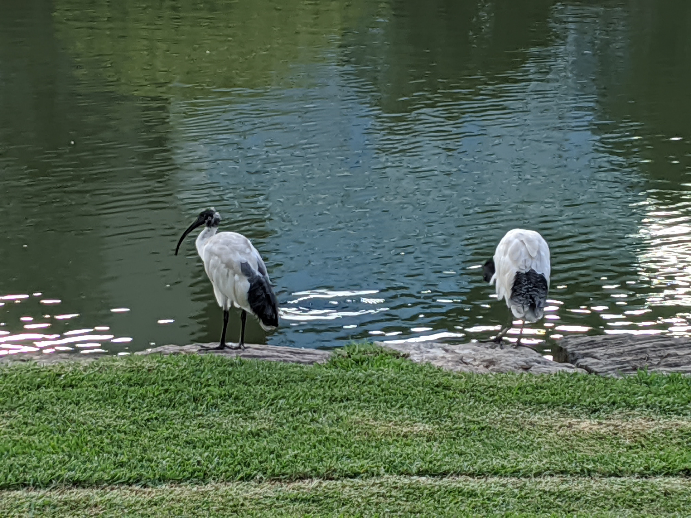

Bystander intervention in sexual harassment
========================================================
incremental: false

<br><br>
The Project: How do victims of sexual harassment perceive ‘indirect’ intervention by bystanders?

***


Exciting research design
========================================================

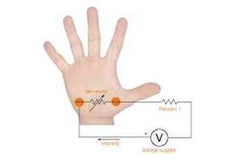

--


Project progress
========================================================
incremental: true

--
✓ Ethics approval
--
✓ Scenarios written and filmed
--
✓ VR lab booked
--
✓ GSR sensor and questionnaires ready
--
X Data collection with pilot participants
--

COVID-19 struck
========================================================

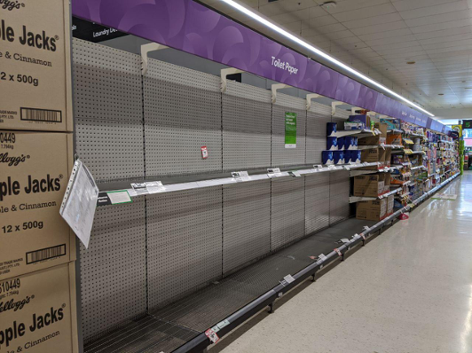

Talk was canceled :(
========================================================


... until now!
========================================================

So let's now explore spatial data analysis in R

packages 
========================================================


```r
install.packages('rnaturalearth', 'sf', 'tmap', 'spatstat', 'raster', 'leaflet', 'dplyr')
```


What is spatial information?
========================================================

- Place
- Attributes
- Objects (points, lines, areas (polygons))


Points, lines, polygons
=======================================================
<div align="center">

</div>


[https://rekadata.net/blog/hot-routes-tutorial/](https://rekadata.net/blog/hot-routes-tutorial/)


An example
========================================================

Get some data


```r
covid19 <- read.csv("https://covid19.who.int/WHO-COVID-19-global-data.csv")
```

Wrangle the data
========================================================


```r
library(dplyr)

covid19 <- covid19 %>% 
  select(Country, Cumulative_deaths) %>% 
  group_by(Country) %>% 
  summarise(maxcd = max(Cumulative_deaths))
```


Let's see
========================================================


```r
head(covid19)
```

```
# A tibble: 6 x 2
  Country     maxcd
  <chr>       <int>
1 Afghanistan   774
2 Albania        65
3 Algeria       912
4 Andorra        52
5 Angola         13
6 Anguilla        0
```


So...
=======================

...how to put this on a map?

--

We need some sort of reference


RNaturalearth
=======================


```r
library(rnaturalearth)
```

**rnaturalearth** does two main things.

1. Contains pre-downloaded vector maps for :
    + countries `ne_countries()`
    + states `ne_states()`
    + coastline `ne_coastline()`
2. Has `ne_download()` function to facilitate download of other vector and raster maps.

see more here: [https://cran.r-project.org/web/packages/rnaturalearth/vignettes/rnaturalearth.html](https://cran.r-project.org/web/packages/rnaturalearth/vignettes/rnaturalearth.html)

Get an outline for a world map
===================================


```r
world <- ne_countries(returnclass='sf')
```

Plot the geometry with sf
===================================


```r
library(sf)

plot(st_geometry(world))
```

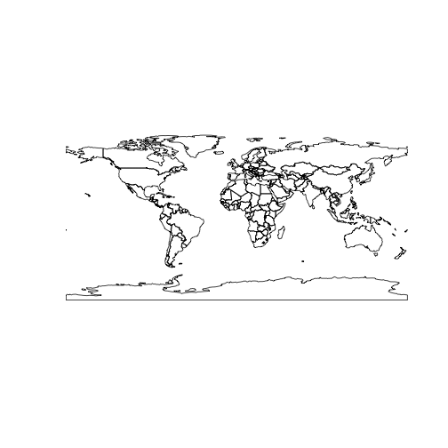


View attributes of 'world'
===================================


```r
head(world)
```

```
Simple feature collection with 6 features and 63 fields
geometry type:  MULTIPOLYGON
dimension:      XY
bbox:           xmin: -73.41544 ymin: -55.25 xmax: 75.15803 ymax: 42.68825
CRS:            +proj=longlat +datum=WGS84 +no_defs +ellps=WGS84 +towgs84=0,0,0
  scalerank      featurecla labelrank           sovereignt sov_a3 adm0_dif
0         1 Admin-0 country         3          Afghanistan    AFG        0
1         1 Admin-0 country         3               Angola    AGO        0
2         1 Admin-0 country         6              Albania    ALB        0
3         1 Admin-0 country         4 United Arab Emirates    ARE        0
4         1 Admin-0 country         2            Argentina    ARG        0
5         1 Admin-0 country         6              Armenia    ARM        0
  level              type                admin adm0_a3 geou_dif
0     2 Sovereign country          Afghanistan     AFG        0
1     2 Sovereign country               Angola     AGO        0
2     2 Sovereign country              Albania     ALB        0
3     2 Sovereign country United Arab Emirates     ARE        0
4     2 Sovereign country            Argentina     ARG        0
5     2 Sovereign country              Armenia     ARM        0
               geounit gu_a3 su_dif              subunit su_a3 brk_diff
0          Afghanistan   AFG      0          Afghanistan   AFG        0
1               Angola   AGO      0               Angola   AGO        0
2              Albania   ALB      0              Albania   ALB        0
3 United Arab Emirates   ARE      0 United Arab Emirates   ARE        0
4            Argentina   ARG      0            Argentina   ARG        0
5              Armenia   ARM      0              Armenia   ARM        0
                  name            name_long brk_a3             brk_name
0          Afghanistan          Afghanistan    AFG          Afghanistan
1               Angola               Angola    AGO               Angola
2              Albania              Albania    ALB              Albania
3 United Arab Emirates United Arab Emirates    ARE United Arab Emirates
4            Argentina            Argentina    ARG            Argentina
5              Armenia              Armenia    ARM              Armenia
  brk_group abbrev postal                    formal_en formal_fr note_adm0
0      <NA>   Afg.     AF Islamic State of Afghanistan      <NA>      <NA>
1      <NA>   Ang.     AO  People's Republic of Angola      <NA>      <NA>
2      <NA>   Alb.     AL          Republic of Albania      <NA>      <NA>
3      <NA> U.A.E.     AE         United Arab Emirates      <NA>      <NA>
4      <NA>   Arg.     AR           Argentine Republic      <NA>      <NA>
5      <NA>   Arm.    ARM          Republic of Armenia      <NA>      <NA>
  note_brk            name_sort name_alt mapcolor7 mapcolor8 mapcolor9
0     <NA>          Afghanistan     <NA>         5         6         8
1     <NA>               Angola     <NA>         3         2         6
2     <NA>              Albania     <NA>         1         4         1
3     <NA> United Arab Emirates     <NA>         2         1         3
4     <NA>            Argentina     <NA>         3         1         3
5     <NA>              Armenia     <NA>         3         1         2
  mapcolor13  pop_est gdp_md_est pop_year lastcensus gdp_year
0          7 28400000      22270       NA       1979       NA
1          1 12799293     110300       NA       1970       NA
2          6  3639453      21810       NA       2001       NA
3          3  4798491     184300       NA       2010       NA
4         13 40913584     573900       NA       2010       NA
5         10  2967004      18770       NA       2001       NA
                    economy              income_grp wikipedia fips_10 iso_a2
0 7. Least developed region           5. Low income        NA    <NA>     AF
1 7. Least developed region  3. Upper middle income        NA    <NA>     AO
2      6. Developing region  4. Lower middle income        NA    <NA>     AL
3      6. Developing region 2. High income: nonOECD        NA    <NA>     AE
4   5. Emerging region: G20  3. Upper middle income        NA    <NA>     AR
5      6. Developing region  4. Lower middle income        NA    <NA>     AM
  iso_a3 iso_n3 un_a3 wb_a2 wb_a3 woe_id adm0_a3_is adm0_a3_us adm0_a3_un
0    AFG    004   004    AF   AFG     NA        AFG        AFG         NA
1    AGO    024   024    AO   AGO     NA        AGO        AGO         NA
2    ALB    008   008    AL   ALB     NA        ALB        ALB         NA
3    ARE    784   784    AE   ARE     NA        ARE        ARE         NA
4    ARG    032   032    AR   ARG     NA        ARG        ARG         NA
5    ARM    051   051    AM   ARM     NA        ARM        ARM         NA
  adm0_a3_wb     continent region_un       subregion                  region_wb
0         NA          Asia      Asia   Southern Asia                 South Asia
1         NA        Africa    Africa   Middle Africa         Sub-Saharan Africa
2         NA        Europe    Europe Southern Europe      Europe & Central Asia
3         NA          Asia      Asia    Western Asia Middle East & North Africa
4         NA South America  Americas   South America  Latin America & Caribbean
5         NA          Asia      Asia    Western Asia      Europe & Central Asia
  name_len long_len abbrev_len tiny homepart                       geometry
0       11       11          4   NA        1 MULTIPOLYGON (((61.21082 35...
1        6        6          4   NA        1 MULTIPOLYGON (((16.32653 -5...
2        7        7          4   NA        1 MULTIPOLYGON (((20.59025 41...
3       20       20          6   NA        1 MULTIPOLYGON (((51.57952 24...
4        9        9          4   NA        1 MULTIPOLYGON (((-65.5 -55.2...
5        7        7          4   NA        1 MULTIPOLYGON (((43.58275 41...
```

Variables in 'world'
===================================


```r
names(world)
```

```
 [1] "scalerank"  "featurecla" "labelrank"  "sovereignt" "sov_a3"    
 [6] "adm0_dif"   "level"      "type"       "admin"      "adm0_a3"   
[11] "geou_dif"   "geounit"    "gu_a3"      "su_dif"     "subunit"   
[16] "su_a3"      "brk_diff"   "name"       "name_long"  "brk_a3"    
[21] "brk_name"   "brk_group"  "abbrev"     "postal"     "formal_en" 
[26] "formal_fr"  "note_adm0"  "note_brk"   "name_sort"  "name_alt"  
[31] "mapcolor7"  "mapcolor8"  "mapcolor9"  "mapcolor13" "pop_est"   
[36] "gdp_md_est" "pop_year"   "lastcensus" "gdp_year"   "economy"   
[41] "income_grp" "wikipedia"  "fips_10"    "iso_a2"     "iso_a3"    
[46] "iso_n3"     "un_a3"      "wb_a2"      "wb_a3"      "woe_id"    
[51] "adm0_a3_is" "adm0_a3_us" "adm0_a3_un" "adm0_a3_wb" "continent" 
[56] "region_un"  "subregion"  "region_wb"  "name_len"   "long_len"  
[61] "abbrev_len" "tiny"       "homepart"   "geometry"  
```

Join the covid19 data
===================================


```r
cov_map <- left_join(world, covid19, by = c("sovereignt" = "Country"))
```

Plot with tmap
===================================


```r
library(tmap)

tm_shape(cov_map) + 
  tm_polygons("maxcd")
```


Missing? 
===================================


```r
cov_map %>% filter(is.na(maxcd)) %>% select(sovereignt)
```

```
Simple feature collection with 31 features and 1 field
geometry type:  MULTIPOLYGON
dimension:      XY
bbox:           xmin: -180 ymin: -90 xmax: 180 ymax: 81.2504
CRS:            +proj=longlat +datum=WGS84 +no_defs +ellps=WGS84 +towgs84=0,0,0
First 10 features:
          sovereignt                       geometry
1         Antarctica MULTIPOLYGON (((-59.57209 -...
2        The Bahamas MULTIPOLYGON (((-77.53466 2...
3            Bolivia MULTIPOLYGON (((-62.84647 -...
4             Brunei MULTIPOLYGON (((114.204 4.5...
5        Ivory Coast MULTIPOLYGON (((-2.856125 4...
6  Republic of Congo MULTIPOLYGON (((12.99552 -4...
7    Northern Cyprus MULTIPOLYGON (((32.73178 35...
8     Czech Republic MULTIPOLYGON (((16.96029 48...
9     United Kingdom MULTIPOLYGON (((-61.2 -51.8...
10    United Kingdom MULTIPOLYGON (((-5.661949 5...
```


Other columns for name?
===================================


```r
names(world)
```

```
 [1] "scalerank"  "featurecla" "labelrank"  "sovereignt" "sov_a3"    
 [6] "adm0_dif"   "level"      "type"       "admin"      "adm0_a3"   
[11] "geou_dif"   "geounit"    "gu_a3"      "su_dif"     "subunit"   
[16] "su_a3"      "brk_diff"   "name"       "name_long"  "brk_a3"    
[21] "brk_name"   "brk_group"  "abbrev"     "postal"     "formal_en" 
[26] "formal_fr"  "note_adm0"  "note_brk"   "name_sort"  "name_alt"  
[31] "mapcolor7"  "mapcolor8"  "mapcolor9"  "mapcolor13" "pop_est"   
[36] "gdp_md_est" "pop_year"   "lastcensus" "gdp_year"   "economy"   
[41] "income_grp" "wikipedia"  "fips_10"    "iso_a2"     "iso_a3"    
[46] "iso_n3"     "un_a3"      "wb_a2"      "wb_a3"      "woe_id"    
[51] "adm0_a3_is" "adm0_a3_us" "adm0_a3_un" "adm0_a3_wb" "continent" 
[56] "region_un"  "subregion"  "region_wb"  "name_len"   "long_len"  
[61] "abbrev_len" "tiny"       "homepart"   "geometry"  
```


Create new column for joining
===================================


```r
world <- world %>% 
  mutate(joining_name = case_when(
    sovereignt %in% covid19$Country ~ sovereignt,
    admin %in% covid19$Country ~ admin,
    name %in% covid19$Country ~ name, 
    name_long %in% covid19$Country ~ name_long, 
    brk_name %in% covid19$Country ~ brk_name,
    formal_en %in% covid19$Country ~ formal_en, 
    name_sort %in% covid19$Country ~ name_sort,
    name_alt %in% covid19$Country ~ name_alt
    ))
```


Join again
===================================


```r
cov_map <- left_join(world, covid19, by = c("joining_name" = "Country"))
```


Map
===================================


```r
tm_shape(cov_map) + 
  tm_polygons("maxcd")
```

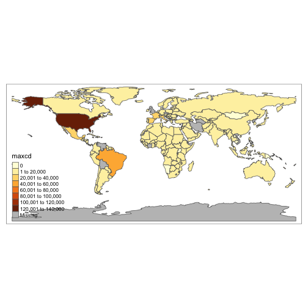


Other shapes
===================================


```r
tm_shape(cov_map) + 
  tm_bubbles("maxcd")
```

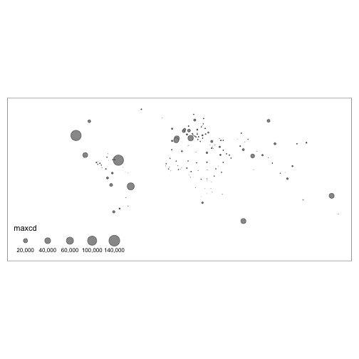


Add context
===================================


```r
tm_shape(cov_map) + 
  tm_borders() + 
  tm_bubbles("maxcd")
```

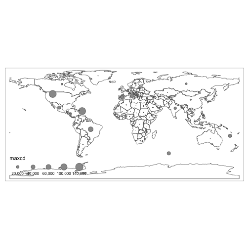


More shapes
==================================

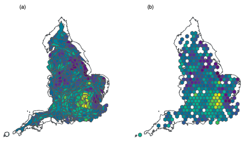

***
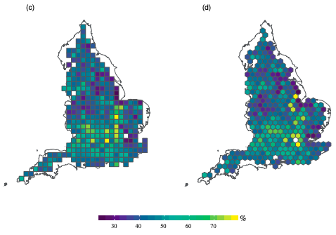

[https://journals.sagepub.com/doi/abs/10.1177/2399808319873923](https://journals.sagepub.com/doi/abs/10.1177/2399808319873923) (or [pre-print](https://osf.io/preprints/socarxiv/t6agd/))


What about points?
========================================================

Get some data from Greater Manchester Police (I've already downloaded but all available from [data.police.uk](https://data.police.uk/)):


```r
crimes <- read.csv("https://raw.githubusercontent.com/jjmedinaariza/CrimeMapping/master/gmpcrime.csv")
burglary <- filter(crimes, crime_type == "Burglary")
head(burglary)
```

```
   X      long      lat   LSOA_id   LSOA_name crime_type   month
1 10 -2.436669 53.62553 E01004804 Bolton 001C   Burglary 2017-01
2 11 -2.438458 53.62603 E01004804 Bolton 001C   Burglary 2017-01
3 12 -2.435481 53.62471 E01004804 Bolton 001C   Burglary 2017-01
4 13 -2.438458 53.62603 E01004804 Bolton 001C   Burglary 2017-01
5 23 -2.404133 53.61154 E01004788 Bolton 002A   Burglary 2017-01
6 24 -2.404133 53.61154 E01004788 Bolton 002A   Burglary 2017-01
```


Making long and lat 'spatial'
========================================================

Transform the dataframe with crime information into a sf object


```r
burglary_spatial <-  st_as_sf(burglary, coords = c("long", "lat"), 
                 crs = 4326, agr = "constant")
```


Plot
========================================================


```r
plot(st_geometry(burglary_spatial))
```

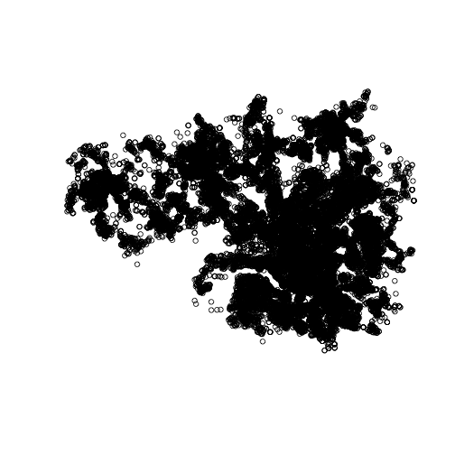


Subset based on location
========================================================

Get polygon for Manchester wards, select 'Fallowfied' ward 


```r
manchester_ward <- st_read("https://raw.githubusercontent.com/RUMgroup/Spatial-data-in-R/master/rumgroup/data/wards.geojson", quiet = TRUE)

fallowfield <- manchester_ward %>% filter(wd16nm == "Fallowfield")

plot(st_geometry(fallowfield))
```

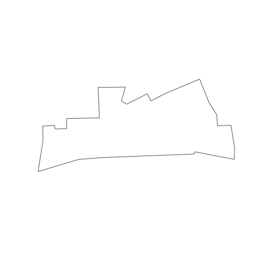


CRS
========================================================


```r
#Change coordinate systems
st_crs(burglary_spatial)
```

```
Coordinate Reference System:
  User input: EPSG:4326 
  wkt:
GEOGCS["WGS 84",
    DATUM["WGS_1984",
        SPHEROID["WGS 84",6378137,298.257223563,
            AUTHORITY["EPSG","7030"]],
        AUTHORITY["EPSG","6326"]],
    PRIMEM["Greenwich",0,
        AUTHORITY["EPSG","8901"]],
    UNIT["degree",0.0174532925199433,
        AUTHORITY["EPSG","9122"]],
    AUTHORITY["EPSG","4326"]]
```

***

```r
st_crs(fallowfield)
```

```
Coordinate Reference System:
  User input: 27700 
  wkt:
PROJCS["OSGB 1936 / British National Grid",
    GEOGCS["OSGB 1936",
        DATUM["OSGB_1936",
            SPHEROID["Airy 1830",6377563.396,299.3249646,
                AUTHORITY["EPSG","7001"]],
            TOWGS84[446.448,-125.157,542.06,0.15,0.247,0.842,-20.489],
            AUTHORITY["EPSG","6277"]],
        PRIMEM["Greenwich",0,
            AUTHORITY["EPSG","8901"]],
        UNIT["degree",0.0174532925199433,
            AUTHORITY["EPSG","9122"]],
        AUTHORITY["EPSG","4277"]],
    PROJECTION["Transverse_Mercator"],
    PARAMETER["latitude_of_origin",49],
    PARAMETER["central_meridian",-2],
    PARAMETER["scale_factor",0.9996012717],
    PARAMETER["false_easting",400000],
    PARAMETER["false_northing",-100000],
    UNIT["metre",1,
        AUTHORITY["EPSG","9001"]],
    AXIS["Easting",EAST],
    AXIS["Northing",NORTH],
    AUTHORITY["EPSG","27700"]]
```

CRS
========================================================


```r
st_crs(fallowfield) == st_crs(burglary_spatial)
```

```
[1] FALSE
```

Change CRS
========================================================


```r
fallowfield <- st_transform(fallowfield, 4326)
```


Select burglaries within ward boundary
========================================================

intersection


```r
bur_fal <- st_intersects(fallowfield, burglary_spatial)
```
***
subsetting


```r
bur_fal <- burglary_spatial[unlist(bur_fal),]
```


Check in
============================================


```r
tm_shape(fallowfield) + 
  tm_fill() +
  tm_shape(bur_fal) +
  tm_dots()
```

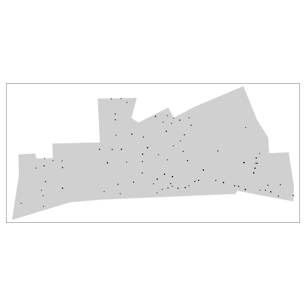


Let's look at some point patterns
============================================


```r
library(spatstat)
```


First we transform the CRS (spatstat requires projected coordinates)


```r
fallowfield_proj <- st_transform(fallowfield, 27700)
```

Then we use the as.owin function to define the window. 


```r
window <- as.owin(fallowfield_proj)
```


More data prep
==============================================
Extract the coordinates from our sf point data into a matrix


```r
bur_fal <- st_transform(bur_fal, 27700) #we must transform these too to match our window in BNG
sf_bur_fal_coords <- matrix(unlist(bur_fal$geometry), ncol = 2, byrow = T)
```

Use the `ppp` function to create the object using the information from our matrix and the window that we created.


```r
bur_ppp <- ppp(x = sf_bur_fal_coords[,1], y = sf_bur_fal_coords[,2],
                   window = window, check = T)
```


Duplicates?
==============================================
We can check the duplication in a `ppp` object:


```r
any(duplicated(bur_ppp))
```

```
[1] TRUE
```

And count the number of coincidence points: 


```r
sum(multiplicity(bur_ppp) > 1)
```


Check-in
==============================================

```r
tm_shape(fallowfield) + 
  tm_fill() +
  tm_shape(bur_fal) +
  tm_dots(alpha=0.4, size=1)
```

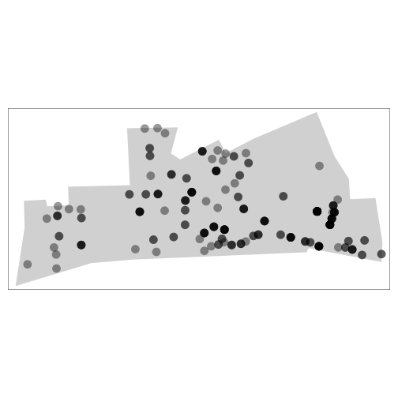


Jitter
==============================================

```r
jitter_bur <- rjitter(bur_ppp, retry=TRUE, nsim=1, drop=TRUE)
plot(jitter_bur)
```

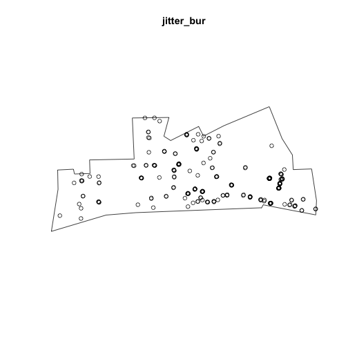


Quadrants
==============================================


```r
Q <- quadratcount(jitter_bur, nx = 4, ny = 3)
plot(jitter_bur)
plot(Q, add = TRUE, cex = 2)
```

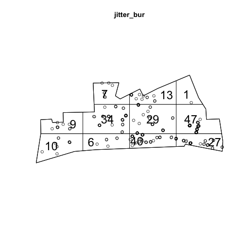

Kernel Density Estimation maps
==============================================


Making KDE maps
==============================================

```r
ds <- density(jitter_bur)
plot(ds, main='Burglary density in Fallowfield')
```


Adding context: turn the KDE map into a raster layer
==============================================


```r
library(raster)
```


```r
dmap1 <- density.ppp(jitter_bur, sigma = bw.ppl(jitter_bur),edge=T)
r1 <- raster(dmap1)
#remove very low density values
r1[r1 < 0.0001 ] <- NA
```


Add projection to raster layer
==============================================


```r
crs(r1) <- "+proj=tmerc +lat_0=49 +lon_0=-2 +k=0.9996012717 +x_0=400000 +y_0=-100000 +ellps=airy +towgs84=446.448,-125.157,542.06,0.15,0.247,0.842,-20.489 +units=m +no_defs"
```

And map with leaflet
==============================================


```r
library(leaflet)
```


```r
leaflet() %>% 
  addTiles() %>%
  addRasterImage(r1, opacity = 0.8)
```

Map here: [https://rekadata.net/talks/leaflet_kde_map.html](https://rekadata.net/talks/leaflet_kde_map.html)


Resources
===========================================
- Crime Mapping Textbook in progress: [https://maczokni.github.io/crime_mapping/](https://maczokni.github.io/crime_mapping/)
- Cartograms hexograms etc: [https://journals.sagepub.com/doi/abs/10.1177/2399808319873923](https://journals.sagepub.com/doi/abs/10.1177/2399808319873923) (or [pre-print](https://osf.io/preprints/socarxiv/t6agd/)))
- [Hot routes tutorial](https://rekadata.net/blog/hot-routes-tutorial/)
- [Spatstat vignette](https://cran.r-project.org/web/packages/spatstat/vignettes/shapefiles.pdf)
- [Geocomputation with R](https://geocompr.robinlovelace.net/)
