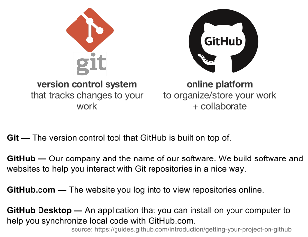
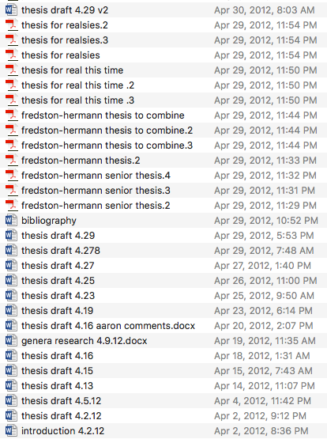
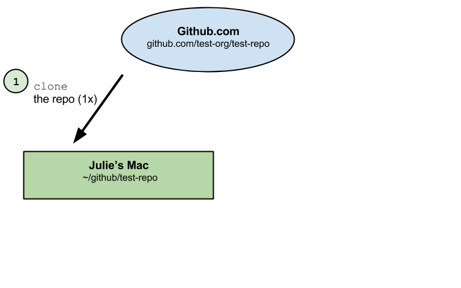
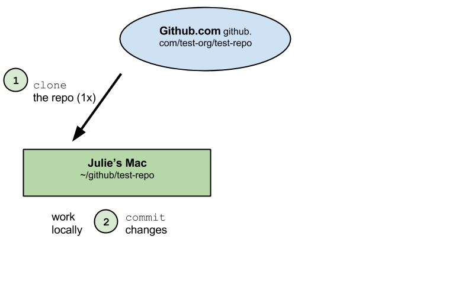
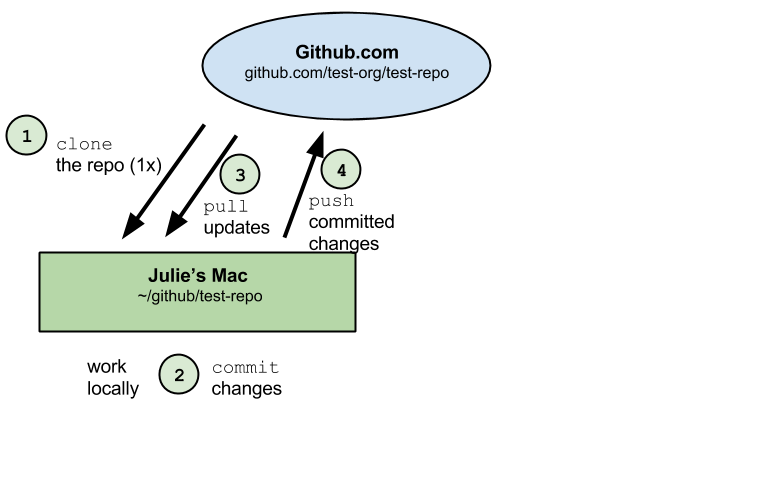
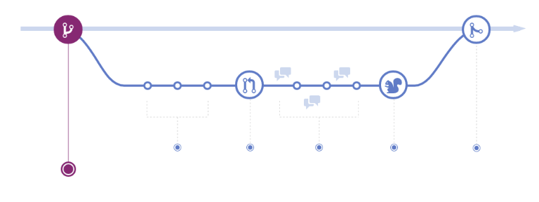
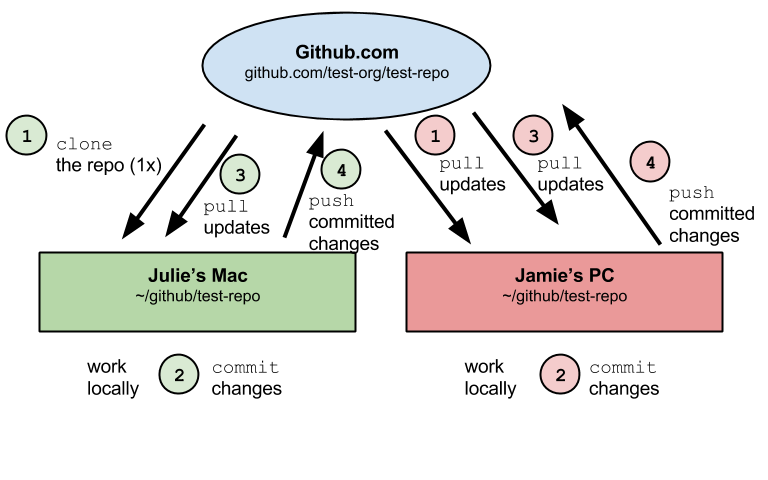
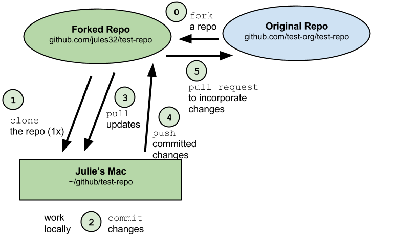

## Quick Intro

* Who am I?

* Disclaimer

  * I have been using github for about 1.5 years
  * I am a conservation scientist, not a computer scientist
  * I am self/community taught thanks to the amazing R community

* Please comment in the chat window with any questions or other helpful tips/tricks/resources

## What is Git?

* Git is a distributed version control system that keeps track of changes to files and projects over time

  
Git is distinct from GitHub, but we will mostly be referring to Github today. 
  
(definition from [GitHub.com](https://guides.github.com/introduction/getting-your-project-on-github))

## What is GitHub?  

* [**Github**](https://github.com) is a website that hosts Git repositories online – making it easier to share code and collaborate

Similar to Dropbox, you have certain folders on your local computer that will be 'watched', with any changes able to be synced online. However, with GitHub, you have more control about what is synced, and how often. You can store, share, track changes and collaboratively edit many filetypes (including this presentation!) using any application. There are many other great features, including a to-do list you can share with collaborators (called Issues). 

## Why learn and use GitHub? 

* Does this look familiar?

## Why learn and use Github?

* **Version control** - Track all of your changes clearly and unambiguously, without proliferating files or losing old versions
* Used for **many programming languages**, although we'll only cover its interface with RStudio. 
* **Facilitates collaboration** because multiple people can work on code together
* Great **organizational tool** for individual projects too.
* **Back up code**
* **Easily switch between computers**
* **Undo mistakes**
* **'comment' on changes**
* **Project management**
* And much **more!**

## What you'll need for this tutorial

*You don't need to be proficient in R to understand this workshop!* 

* You will need:
  * An updated version of RStudio on your laptop
  * An account on [github.com](https://www.github.com/)

* Please ask questions in the chat box as we go

* You can read more about why and how to use GitHub from:
  * [Hadley Wickham](https://github.com/rstudio/webinars/blob/master/06-Collaboration-and-time-travel-version-control/git-github.pdf)
  * [Karl Broman](http://kbroman.org/github_tutorial/pages/why.html)
  * [Ben Best](http://htmlpreview.github.io/?https://github.com/eco-data-science/ds-git/blob/gh-pages/index.html) 

## Workshop Outline

1. Github Vocabulary
2. GitHub Structure
3. GitHub Workflow
4. RStudio Practice
5. Non-R Options 
6. Best Practices
7. Resources

## Github Vocabulary

* **Repository ('repo')** - the most basic element of GitHub. Imagine as a project's folder which contains all of the project files (including documentation), and stores each file's revision history. Repositories can have multiple collaborators and can be either public or private.

* **Push** - to push means to send your committed changes to a remote repository on GitHub.com. For instance, if you change something locally, you can push those changes so that others may access them.

* **Pull** - refers to when you are fetching in changes and merging them. For instance, if someone has edited the remote file you're both working on, you'll want to pull in those changes to your local copy so that it's up to date. 

## Github Vocabulary

* **Commit** - or is an individual change to a file (or set of files). Github keeps a record of the specific changes commited along with who made them and when. 

* **Issue** - are suggested improvements, tasks or questions related to the repository. They can be created by anyone (for public repositories), and are moderated by repository collaborators. 

* **Clone** - is a copy of a repository that lives on your computer instead of on a website's server somewhere. When you make a clone, you can edit the files in your preferred editor and use Git to keep track of your changes without having to be online. The clone is still connected to the remote version so that you can push your local changes to keep them synced when you're online.

## Github Vocabulary

* **Fork** - is a personal copy of another user's repository that lives on your account. Forks allow you to freely make changes to a project without affecting the original upstream repository. You can also open a pull request in the upstream repository and keep your fork synced with the latest changes since both repositories are still connected.

* **Branch** - is a parallel version of a repository. It is contained within the repository, but does not affect the primary or master branch allowing you to work freely without disrupting the "live" version. When you've made the changes you want to make, you can merge your branch back into the master branch to publish your changes.

You can find more github vocabulary [here](https://docs.github.com/en/github/getting-started-with-github/github-glossary)

## GitHub Structure

Files are stored in **repositories**, owned by **users** / **organizations**.  

Same structure across all orgs/repos: familiar, easy to navigate. 

Here are some examples to explore later on. 

* **repositories**: [github-intro](https://github.com/eco-data-science/github-intro), [dplyr](https://github.com/hadley/dplyr), [ggplot2]() 
* **users**: [jules32](https://github.com/jules32), [hadley](https://github.com/hadley), [jennybc](https://github.com/jennybc)
* **organizations**: [twitter](https://github.com/twitter), [netflix](https://github.com/netflix), [rstudio](https://github.com/rstudio), [nceas](https://github.com/nceas), [ohi-science](https://github.com/ohi-science)

## GitHub Workflow and Vocabulary

Let's discuss how this works first, and then we're going to practice with RStudio.

You come across code for an R package that will randomly download 10 dog pictures from the internet given the name of a dog breed. Obviously, you need this on your computer, so you're going to **clone** it. 

## GitHub Workflow and Vocabulary

* **clone**: download an identical copy - a 'clone' - of a repository to your local computer. Unlike most downloads, cloned repositories can still be synced with the online version(s). 

## GitHub Workflow and Vocabulary

Now that you have a local copy of this package, you edit the code to only download pictures of puppies. When you're at a good stopping point and want to save your progress, you 'commit' the code with an informative message describing the changes for your future self or anyone else who sees this code. 

I think of commit as the GitHub version of 'save', but you also get to add a comment. 

## GitHub Workflow and Vocabulary

* **commit**: message associated with your changes ([best practices](http://r-pkgs.had.co.nz/git.html#commit-best-practices))

## GitHub Workflow and Vocabulary

* **commit**: message associated with your changes ([best practices](http://r-pkgs.had.co.nz/git.html#commit-best-practices))

## GitHub Workflow and Vocabulary

But wait! Before you share your newly updated R package with the world, you want to be sure the person who created it hasn't made any changes to the original (bug fixes, for example). To download new changes to the code from others, you 'pull' from GitHub. **This is also how you can switch computers and easily work on the same code.** 

If there are differences that can be easily resolved (e.g., the R package developer fixed a bug by adding a line of code), your repository will be 'merged' accordingly. If the differences *conflict*, you have to resolve them manually by telling GitHub which changes to keep and which to ignore. 

## Github Workflow and Vocabulary

* **pull**: sync a repo on your computer with the online version. Do this frequently to avoid **merge conflicts** or working on outdated code. 

## GitHub Workflow and Vocabulary

After committing your changes and pulling the repository again, you're ready to share your puppy image search code from your local computer to GitHub. To do this, you upload - or 'push' - the code. 

* **push**: sync the online repo with your version, only possible after committing

## GitHub Workflow: branches

GitHub's branching approach is very intuitive to some people, and not to others. 

[guides.github.com/introduction/flow](https://guides.github.com/introduction/flow)

## Github Workflow: branches

There are (at least) two ways to work on an existing repository: 

* Clone it and then push and pull directly from the original ('master') - suitable for small group collaborations. 
* Create a 'fork' in the branch so that you can make any changes to all of the repository contents without affecting the other branches, such as the master branch. This is suitable for when you just want to copy code, or for very large collaborations. 

## GitHub Workflow: sync with branch

**sync ~ pull + commit + pull + push**  
All collaborators work independently but sync regularly

## GitHub Workflow: fork and pull

**fork + pull + commit + push + pull request**

## Github Workflow and Vocabulary: Summary 

1. **fork a repo** to your user account
2. **clone the repo** to your computer
3. **edit a file**, inspect differences
4. **commit** changes
5. **pull**
6. **push**
7. repeat!

## RStudio Practice

In order to follow the demo, [git](https://git-scm.com/downloads) and [RStudio](https://www.rstudio.com/) must be installed on your laptop, and you must have a [GitHub](https://github.com/) account. Don't worry, they're all free! 

## RStudio Practice

Open RStudio and navigate to tools -> Global Options. Go to Git/SVN and click 'enable version control interface for RStudio projects'. If you have any issues, flag one of us down or check the [RStudio help page](https://support.rstudio.com/hc/en-us/articles/200532077-Version-Control-with-Git-and-SVN). 

One more thing: To use the GitHub interface in RStudio, you'll need to work with R projects. R projects are associated with working directories and they help with version control and with switching between projects. [more info](https://support.rstudio.com/hc/en-us/articles/200526207-Using-Projects)

## RStudio Practice 

Try finding this repository, `getting_started_github`, on my github page [@cdkuempel](https://github.com/cdkuempel). 

Remember, you can *clone* if you want a local copy on your computer from which you can contribute changes to my project, or *fork* if you want your own branch to mess with. 

Click 'fork' on the top right. You will see a copy of this same repository, but rather than cdkuempel/github-intro-2, it's called **yourusername**/getting_started_github, and it shows where it was forked from. 

Now, it's yours! To clone this repository so you can edit it in R, click the green 'code or download button', and then the clipboard icon to copy the URL. 

## RStudio Practice

1. Open RStudio and go to file -> new project
2. Click version control, then git
3. Paste the URL you just cloned into the first box. 

The second box is for the name of the project, and the new directory you're creating on your computer. I almost always use the same name as the repository (in this case, `github-intro-2`). 

## RStudio Practice

4. Tell RStudio where to put this repo. 

It is **strongly** recommended that you create a directory in your home directory called 'github', and put all your repositories and code there. To do this, put '~/github' in the third box. 

5. Finally, click 'create project'. (If you get an error doing this, there could be many reasons, but the first thing I try is going back to the repository on GitHub, clicking 'use SSH' or 'use HTTPS' under the green 'code' button (whichever you didn't use last time), and repeating everything on this slide. You might also have to manually create a 'github' folder in your home directory.) 

## RStudio Practice

**Congratulations**, you just cloned a repository from GitHub! It's now yours to edit in RStudio. Under 'files' in the bottom right window, you'll see everything in this repository, including this presentation. Open practicescript.R, make any edit you like, and save it. 

## RStudio Practice

You'll notice the top right pane has a tab called 'git'. Click on it, and you'll see all the files in this directory. Check the box next to practicescript.R and click 'commit' above. Enter a message describing your changes in the box on the top right and click 'commit'. 

**Don't forget to pull before you push!** Because no one else should be editing your forked repository, there shouldn't be any changes when you pull. Finally, push your commit, and then go back to GitHub to see the changes in the repository. 

## RStudio Practice

If you wanted to create a new repository, you would go to the GitHub home page, click 'new repository' and follow the prompts, and then use the same process we just covered to clone it and start editing code in RStudio. You can drag and drop files from other locations into the repo directory on your local machine and then push them to GitHub, if they aren't too big. 

## Non-R Options: Creating Repositories

**On GitHub.com**, you can create new repos

**On your computer**, you can create new repos in several ways: 

* [**GitHub Desktop**](https://desktop.github.com/)
* [**RStudio**](www.rstudio.com)
* **shell/command line**

## Non-R Options: Syncing 

**On GitHub.com**, you can clone a repo to your computer.  

**On your computer**, you can clone/sync repos in several ways: 

* [**GitHub Desktop**](https://desktop.github.com/)
* **RStudio** 
* **shell/command line**

When you work on your computer, any edits you make to any files in your repo, using any program, will be tracked. 

## Best Practices

**Pull often!**

**Commit frequently** 

**Be mindful of filepaths**

* We work from a in a folder in our home directory called ***'github'*** (all lowercase!), so that everyone can access the repo with the filepath beginning in `~/github`:
* **Windows**: `Users\[User]\Documents\github\`
* **Mac**: `Users/[User]/github/`

## Thanks

## Resources

**Learn more about GitHub:**

* [**GitHub Guides**](https://guides.github.com/) by GitHub  
* [**Git and GitHub**](http://r-pkgs.had.co.nz/git.html) by Hadley Wickham
* [**Good Resources for Learning Git and GitHub**](https://help.github.com/articles/good-resources-for-learning-git-and-github/) by GitHub
* [**Learn Git Branching**](http://pcottle.github.io/learnGitBranching/) by Peter Cottle
* [**Git/GitHub Guide**](http://kbroman.org/github_tutorial/) by Karl Broman 
* [**Git & GitHub**](http://htmlpreview.github.io/?https://github.com/eco-data-science/ds-git/blob/gh-pages/index.html) by Ben Best

Just Google 'GitHub Tutorial...'

## Thanks

* Email me: c.kuempel@uq.edu.au
* Follow me on Twitter: [@cdkuempel](https://twitter.com/cdkuempel?lang=en)
* Tweet #rstats, #github, #RLadies

