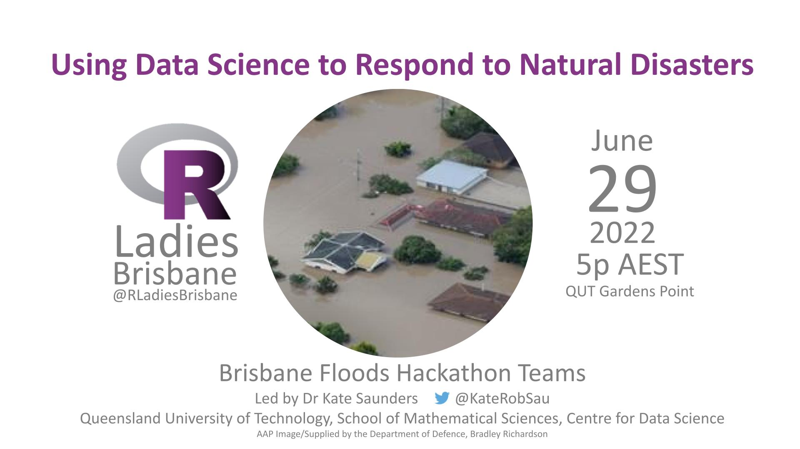

# Using data science to respond to natural disasters

## June 29th, 2022 5pm AEST

### Speakers

* [Kate Saunders](https://twitter.com/KateRobSau)
* Groups from the [Brisbane Floods Hackathon](https://www.eventbrite.com.au/e/rapid-response-hackathon-to-the-recent-floods-tickets-290258299387?keep_tld=1) organised by Drs Kate Saunders and Kate Helmstedt
  * [Real-time Visualisation](https://github.com/rladies/meetup-presentations_brisbane/blob/master/2022/06/Realtime_vis/Real-time%20visualisation%20presentation%202.pdf) - Charlotte Patterson
  * [Past observations](https://github.com/rladies/meetup-presentations_brisbane/blob/master/2022/06/PastObservations/Past_Observations_Group_Slides.pdf) - Dr Ben Fitzpatrick
  * [Social Media Scraping](https://github.com/rladies/meetup-presentations_brisbane/blob/master/2022/06/SocialMediaScraping/SocialMediaScraping.pdf) - Tace Stewart, Lanxi Li
  * Road Closures - Peter Tarbit
  * [Vulnerability Index](https://github.com/rladies/meetup-presentations_brisbane/blob/master/2022/06/VulnerabilityIndex/20220629_VulnerabilityI_RLadiesHackathon.html) - Dr Catherine Kim
  

Welcome to our June event!

[Meetup event](https://www.meetup.com/rladies-brisbane/events/286604612/)

[Presentation slides TBD](TBD)

[Repo for code and data TBD](TBD)

