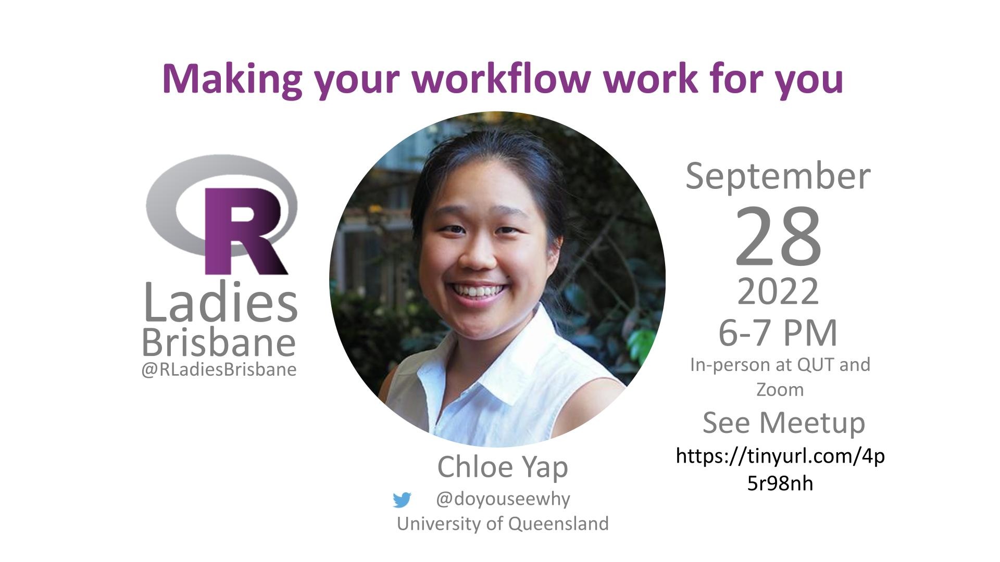

# Making your workflow work for you - Chloe Yap

Welcome to our September event!

[Meetup event](https://tinyurl.com/4p5r98nh)

## Sept. 28th, 2022 6pm AEST

### Speaker

* [Chloe Yap](https://twitter.com/doyouseewhy)
* [Presentation slides](https://github.com/cyap7/RLadies/blob/main/220928_RLadies.pdf)
* [Chole's demo code from the session](https://github.com/cyap7/RLadies)

### Useful URLs Shared during the presentation

* [Noble et al. 2009 A Quick Guide to Organizing Computational Biology Projects](https://journals.plos.org/ploscompbiol/article?id=10.1371/journal.pcbi.1000424)
* [ggstatsplot](https://github.com/IndrajeetPatil/ggstatsplot) package
* [ggrepel](https://ggrepel.slowkow.com/) package
* [R Graph Gallery](https://r-graph-gallery.com/)
* [Inkscape](https://inkscape.org/) open-source vector graphics editor
